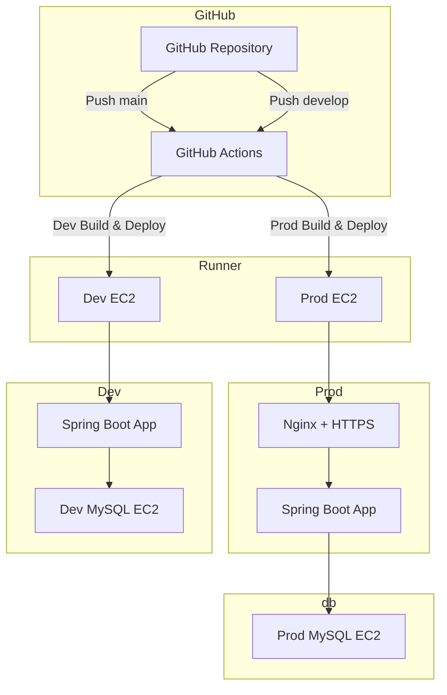

# 인프라 구성

## 인프라와 서비스 구성 설명
- 제가 설계한 아키텍처는
    - prod와 dev를 분리하여 prod에 직접 테스트하지 않고 dev 환경에서 테스트를 진행할 수 있습니다. 이를 통해 프론트엔드나 안드로이드와 협업을 더 편하고 원활하게 진행할 수 있고 dev 환경에서 충분한 검증을 마친 애플리케이션을 prod로 배포할 수 있습니다.
    - 애플리케이션과 데이터베이스를 분리하여 데이터베이스와 애플리케이션이 서로에게 영향을 끼치지 않고, 애플리케이션은 수평확장 가능성을 열어두었습니다.
    - AWS에 배포하여 온 프레미스보다 안전한 환경으로 구축하였습니다. 때문에 예상치못한 네트워크 문제를 방지할 수 있습니다. (온프레미스 환경에서는 신경쓸 네트워크 인프라가 많다고 생각합니다.)
    - 소스 변경 시 자동 빌드/배포가 수행되도록 파이프라인을 구축하여 개발자가 직접 빌드 수행 후 배포 서버에 파일을 옮기고, 실행하는데 드는 시간을 많이 단축할 수 있습니다. 또한 브랜치별로 다른 워크플로우가 실행되어 main은 prod, develop은 dev 환경에 배포되도록 하였습니다.
    - 인증서를 발급받아 https로 통신하여 서비스를 사용하는 사용자와 우리 서버간의 종단간 암호화를 하여 통신하기 때문에 사용자의 정보를 탈취하더라도 이해할 수 없도록 기밀성을 제공하였습니다. (+ 사용자들이 우리 서비스를 믿고 사용할 수 있도록 CA를 통해 인증도 받았습니다.)
    - Swagger를 통해 API-DOCS를 제공하여 서버를 사용하는 클라이언트에게 api 사용 방법을 빠르게 제공해줄 수 있고, 실제로 사용해볼 수 있는 환경을 제공하여 협업을 원활하게 만들었습니다.

## 반영한 내역
### 필수 요구사항
- 애플리케이션을 AWS에 배포 가능한 상태로 구축해야 한다.
  - public 환경의 EC2에 배포 가능한 상태로 구축

- 애플리케이션 서버와 데이터베이스 서버를 물리·네트워크 계층에서 분리해야 한다.
  - 데이터베이스를 실행할 새로운 EC2를 생성하여 분리

- 개발(dev)과 운영(prod)의 설정을 서로 독립적으로 관리·배포해야 한다.
  - prod EC2와 dev EC2를 나눠서 분리

### 추가 요구사항
- 소스 변경 시 자동 빌드·배포가 수행되도록 파이프라인을 구성해야 한다.
  - main 브랜치 변경 시, prod 환경에 빌드/배포가 수행되도록 구성
  - develop 브랜치 변경 시, dev 환경에 빌드/배포가 수행되도록 구성

- 개인 도메인을 애플리케이션에 연결하고 HTTPS를 적용해야 한다.
  - https를 발급받아 nginx에 적용

- 제공 API의 문서 명세를 작성·공개해야 한다.
  - swagger docs가 적용되어 있음

## 반영하지 못한 내역
- 전체 인프라를 다이어그램으로 작성하고 각 구성요소 역할을 설명해야 한다.
- 애플리케이션 로그를 파일 또는 수집기로 영속화하고 조회 절차를 제공해야 한다.
- 서버 자원(CPU·메모리·네트워크 등)을 지표·대시보드로 시각화해야 한다.
- 운영 중 스키마 변경 시 데이터 보존 상태로 마이그레이션 및 재배포를 완료해야 한다.

### API 명세
자세한 API 명세는 아래의 swagger 참고   
[API 목록](https://boogie.p-e.kr/api-docs)

### 아키텍처 그림

| 구성요소                         | 역할                                 |
| ---------------------------- |------------------------------------|
| **GitHub Repository**        | 소스 코드 관리, 브랜치별 변경사항 감지             |
| **GitHub Actions**           | 브랜치별 CI/CD 파이프라인 실행, 빌드/배포 트리거     |
| **Self-hosted Runner (EC2)** | GitHub Actions 워크플로우를 실행하는 실행 환경   |
| **Prod EC2**                 | 프로덕션 환경 애플리케이션 실행, HTTPS 적용        |
| **Dev EC2**                  | 개발 환경 애플리케이션 실행, 데이터베이스 실행, 테스트 목적 |
| **Nginx + HTTPS (Prod)**     | HTTPS 요청 처리, Reverse Proxy 역할      |
| **Prod MySQL EC2**           | 프로덕션 데이터베이스, 별도 EC2에서 운영           |

